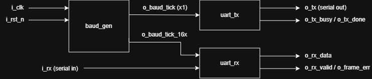
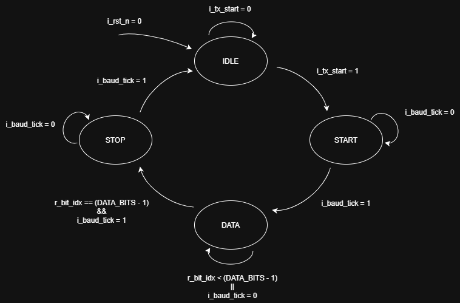
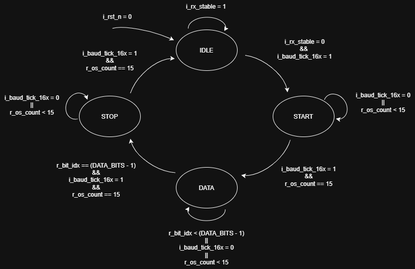
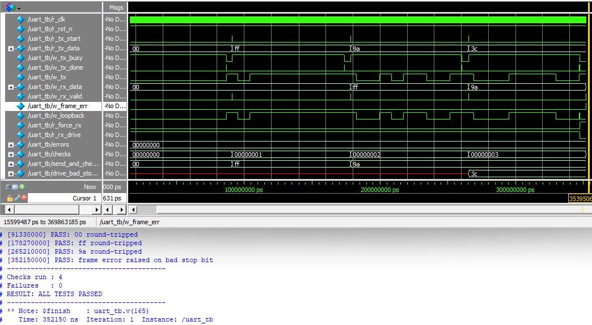

# UART IP Core

A reusable UART IP core written in Verilog, featuring separate transmitter and receiver modules, a parameterized baud-rate generator, and a working deployment on the Intel DE10-Lite FPGA.

## Features

- Fully parameterized clock frequency, baud rate, and data-bit width
- Standard 8-N-1-style framing: 1 start bit, `DATA_BITS` data (LSB first), 1 stop bit
- **RX** with 16x oversampling and 3-sample majority voting for noise tolerance
- 2-flip-flop synchronizer on the async serial input to guard against metastability
- Framing-error detection (bad stop bit) reported alongside each received byte
- **TX** with simple start/busy/done handshake

## System Architecture

## Parameters

| Parameter | Default | Description |
| --- | --- | --- |
| `CLK_FREQ` | `50_000_000` | Input clock frequency (Hz) |
| `BAUD_RATE` | `115_200` | Target baud rate |
| `DATA_BITS` | `8` | Data bits per frame |

## Top-Level Interface (`uart.v`)

| Signal | Direction | Description |
| --- | --- | --- |
| `i_clk` | in | System clock |
| `i_rst_n` | in | Active-low synchronous reset |
| `i_tx_start` | in | Pulse high to begin a transmission |
| `i_tx_data` | in | Byte to send (latched on start) |
| `o_tx_busy` | out | High while a frame is transmitting |
| `o_tx_done` | out | 1-cycle pulse when the stop bit completes |
| `o_tx` | out | Serial line out |
| `i_rx` | in | Serial line in |
| `o_rx_data` | out | Received byte (valid when `o_rx_valid` pulses) |
| `o_rx_valid` | out | 1-cycle pulse indicating a received byte |
| `o_frame_err` | out | 1-cycle pulse (with `o_rx_valid`) if the stop bit was low |

## Repository Structure

| Path | Description |
| --- | --- |
| [`rtl/`](rtl) | Synthesizable UART core source | 
| [`tb/`](tb) | Simulation testbench |
| [`examples/`](examples) | Board-level demo (see [DE10-Lite 7-segment](examples/de10-lite-7seg)) |

> 🎬 **[Watch the video demo](https://youtu.be/gm2INJvLMKM)** with the implementation running on real hardware!

### RTL Files

| File | Description |
| --- | --- |
| [rtl/uart.v](rtl/uart.v) | Top-level core. Wires the baud generator, transmitter, and receiver into a single reusable block and exposes the TX/RX interfaces. |
| [rtl/baud_gen.v](rtl/baud_gen.v) | Parameterized baud-rate generator. Produces a 1x bit-rate strobe (`o_baud_tick`, used by TX) and a 16x oversampling strobe (`o_baud_tick_16x`, used by RX), using rounded integer division to minimize clock drift. |
| [rtl/uart_tx.v](rtl/uart_tx.v) | Transmitter FSM. Latches a byte on `i_tx_start`, then shifts out start, data (LSB first), and stop bits, one per baud tick. |
| [rtl/uart_rx.v](rtl/uart_rx.v) | Receiver FSM. Synchronizes the serial input, detects the start edge, samples each bit near center via majority voting, and publishes the byte with a validity/framing-error pulse. |

## Transmitter State Machine

## Receiver State Machine

The receiver is clocked by the 16x oversampling strobe; `os` below is the
oversample position (0–15) within one bit period.

## Testbench

[`tb/uart_tb.v`](tb/uart_tb.v) is a self-checking loopback testbench for the complete UART core. The transmitter output (`o_tx`) is connected directly to the receiver input (`i_rx`), allowing the testbench to verify end-to-end operation by transmitting several test bytes (`0x00`, `0xFF`, and `0x9A`) and confirming they are received correctly without framing errors.

To validate error detection, the testbench temporarily overrides the serial line to inject an invalid frame with the stop bit held low, verifying that `o_frame_err` is asserted. A watchdog timeout prevents stalled simulations, while each test result and an overall pass/fail summary are printed to the console. Waveforms are also dumped to `uart_tb.vcd` for further inspection.

*QuestaSim Waveform Output*

## License

[MIT](LICENSE) © 2026 Emily Chan
